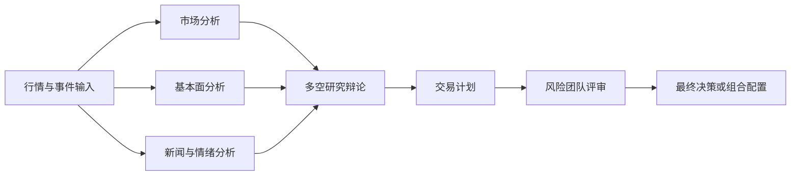

# A Stock Rachtrader

**Rachel 维护的 A 股多智能体研究、决策与组合配置系统。**

A Stock Rachtrader 将行情、技术指标、基本面、新闻与宏观数据交给多个专业 Agent 独立分析，
再通过多空研究、交易决策和风险辩论生成结构化结论。系统同时支持单股研究、多股票组合配置、
事件驱动 API、断点恢复和容器化部署。

> 本项目用于研究与辅助决策，不构成投资建议，也不会自动提交、撤销或结算真实订单。

## 核心功能

### 多智能体决策链

- **Market Analyst**：分析价格、成交量、趋势和技术指标。
- **Fundamentals Analyst**：分析估值、财务报表和公司基本面。
- **News Analyst**：读取个股新闻、全局事件与宏观信息。
- **Sentiment Analyst**：汇总可用的市场情绪信号。
- **Bull / Bear Researchers**：从多空两侧进行结构化辩论。
- **Research Manager**：汇总研究证据并形成投资计划。
- **Trader**：把研究结论转化为交易方向与执行建议。
- **Risk Team**：由激进、中性、保守三个角色进行风险讨论。
- **Portfolio Manager**：输出最终决策或组合权重。



### A 股数据能力

- 自动识别并规范化上海、深圳、北京和科创板股票代码。
- 支持裸代码及 `.SH`、`.SZ`、`.BJ`、`.SS` 等常见格式。
- 可通过 **Tushare**、**阿里云 PostgreSQL** 或 **ETF PostgreSQL** 获取 A 股行情。
- 基于同一份 OHLCV 数据在本地计算技术指标，避免跨数据源口径漂移。
- 从 ETF PostgreSQL 读取估值、基本面和财务报表。
- 财务数据按公告日期限制查询，降低前视偏差风险。
- 从只读事件库读取个股与全局原始新闻。
- 数据库访问使用只读事务，连接参数全部由环境变量提供。

### 单股研究

交互式选择股票、研究日期、分析团队、LLM Provider、模型、研究深度和输出语言，最终生成：

- 市场分析报告
- 基本面报告
- 新闻与情绪报告
- 多空研究记录
- 交易计划
- 风险讨论
- 最终投资决策

### 多股票组合配置

- 一次分析 2–20 只股票。
- 为每只股票输出目标权重，并显式保留现金权重。
- 支持设置单一股票最大仓位。
- 在代码层校验并归一化权重至 100%。
- 支持纯 A 股及 A 股与海外股票混合候选集。
- 分析前验证每个数据源能否覆盖全部标的，不兼容时直接报错。
- 可保存 Markdown 和 JSON 两种组合报告。

### 事件驱动研究 API

内置 FastAPI 服务，可供策略系统通过 HTTP 调用：

- `POST /v1/event-trade-plans`：为单个事件生成交易计划。
- `POST /v1/event-portfolio-plans`：为事件候选集生成组合计划。
- `GET /health/live`：进程存活检查。
- `GET /health/ready`：凭据、状态存储和 Planner 就绪检查。

API 提供 Bearer Token 认证、请求幂等、并发保护、超时控制、状态持久化和错误信息脱敏。

### 数据源路由

各类数据可以独立选择 Provider，并配置有序回退链：

| 数据类型 | 支持的数据源 |
| --- | --- |
| 行情 | ETF PostgreSQL、阿里云 PostgreSQL、Tushare、Alpha Vantage、Yahoo Finance |
| 技术指标 | ETF PostgreSQL、Tushare、Alpha Vantage、Yahoo Finance |
| 基本面 | ETF PostgreSQL、Alpha Vantage、Yahoo Finance |
| 新闻 | ETF Event PostgreSQL、Alpha Vantage、Yahoo Finance |
| 宏观数据 | FRED |
| 预测市场 | Polymarket |
| 社区情绪 | Stocktwits、Reddit |

系统只使用显式配置的数据源链，不会静默接入未选择的 Provider。

### LLM Provider

支持以下模型服务：

- OpenAI 与 Azure OpenAI
- Google Gemini
- Anthropic Claude
- AWS Bedrock
- xAI
- DeepSeek
- Qwen / DashScope 国内与国际端点
- GLM / 智谱国内与国际端点
- MiniMax 国内与国际端点
- OpenRouter
- Groq、Mistral、Moonshot、NVIDIA
- Ollama
- 任意 OpenAI-compatible 服务，如 vLLM、LM Studio、llama.cpp 或自建 Relay

可分别配置快速模型、深度推理模型、推理强度、Temperature 和重试次数。

### 持久化与恢复

- LangGraph 节点级 Checkpoint，异常退出后可从最近成功节点继续。
- 每个股票使用独立 SQLite Checkpoint 文件。
- 持久化决策日志，用于记录预测、结果与复盘信息。
- 报告、缓存和记忆路径均可通过环境变量调整。

## 快速开始

### 环境要求

- Python 3.10 或更高版本
- [uv](https://docs.astral.sh/uv/)
- 至少一个可用的 LLM API Key，或一个本地 OpenAI-compatible / Ollama 服务

### 安装

```bash
git clone https://github.com/rra7963/A-stock-rachtrader.git
cd A-stock-rachtrader
uv sync
cp .env.example .env
```

在 `.env` 中填写你实际使用的模型和数据源凭据。不要提交包含真实密钥的 `.env` 文件。

### 运行单股研究

```bash
uv run tradingagents
```

也可以显式使用 `analyze` 命令：

```bash
uv run tradingagents analyze
uv run tradingagents analyze --checkpoint
uv run tradingagents analyze --clear-checkpoints
```

### 运行组合研究

```bash
uv run tradingagents portfolio "600519.SH,000001.SZ,300750.SZ" \
  --date 2026-08-07 \
  --max-position 25
```

指定输出目录：

```bash
uv run tradingagents portfolio "AAPL,MSFT,NVDA" \
  --max-position 30 \
  --save-path ./reports/us-tech
```

## 常用配置

所有配置均可从 [`.env.example`](.env.example) 开始。

| 环境变量 | 作用 |
| --- | --- |
| `TRADINGAGENTS_LLM_PROVIDER` | 选择 LLM Provider |
| `TRADINGAGENTS_DEEP_THINK_LLM` | 深度推理模型 |
| `TRADINGAGENTS_QUICK_THINK_LLM` | 快速任务模型 |
| `TRADINGAGENTS_LLM_BACKEND_URL` | 自定义模型服务地址 |
| `TRADINGAGENTS_OUTPUT_LANGUAGE` | 报告输出语言 |
| `TRADINGAGENTS_MAX_DEBATE_ROUNDS` | 多空辩论轮数 |
| `TRADINGAGENTS_MAX_RISK_ROUNDS` | 风险讨论轮数 |
| `TRADINGAGENTS_CHECKPOINT_ENABLED` | 是否启用断点恢复 |
| `TRADINGAGENTS_TEMPERATURE` | 模型采样温度 |
| `TRADINGAGENTS_LLM_MAX_RETRIES` | LLM 请求重试次数 |
| `TRADINGAGENTS_DATA_VENDOR_CORE_STOCK_APIS` | 行情数据源链 |
| `TRADINGAGENTS_DATA_VENDOR_TECHNICAL_INDICATORS` | 技术指标数据源链 |
| `TRADINGAGENTS_DATA_VENDOR_FUNDAMENTAL_DATA` | 基本面数据源链 |
| `TRADINGAGENTS_DATA_VENDOR_GET_NEWS` | 新闻数据源 |

A 股 Tushare 示例：

```dotenv
TUSHARE_TOKEN=your-token
TRADINGAGENTS_DATA_VENDOR_CORE_STOCK_APIS=tushare,yfinance
TRADINGAGENTS_DATA_VENDOR_TECHNICAL_INDICATORS=tushare,yfinance
TRADINGAGENTS_DATA_VENDOR_FUNDAMENTAL_DATA=tushare,yfinance
```

OpenAI-compatible 示例：

```dotenv
TRADINGAGENTS_LLM_PROVIDER=openai_compatible
TRADINGAGENTS_LLM_BACKEND_URL=http://localhost:8000/v1
TRADINGAGENTS_DEEP_THINK_LLM=your-model
TRADINGAGENTS_QUICK_THINK_LLM=your-model
```

## Python 调用

### 单股分析

```python
from tradingagents.default_config import DEFAULT_CONFIG
from tradingagents.graph.trading_graph import TradingAgentsGraph

graph = TradingAgentsGraph(debug=False, config=DEFAULT_CONFIG.copy())
state, decision = graph.propagate("600519.SH", "2026-08-07")
print(decision)
```

### 组合配置

```python
from tradingagents.agents.schemas import render_portfolio_allocation
from tradingagents.default_config import DEFAULT_CONFIG
from tradingagents.graph.trading_graph import TradingAgentsGraph

graph = TradingAgentsGraph(debug=False, config=DEFAULT_CONFIG.copy())
states, allocation = graph.propagate_portfolio(
    ["600519.SH", "000001.SZ", "300750.SZ"],
    "2026-08-07",
    max_position_percent=25,
)

print(render_portfolio_allocation(allocation))
graph.save_portfolio_report(allocation)
```

## 启动 API

```bash
export TRADINGAGENTS_API_BEARER_TOKEN="replace-with-a-long-random-token"
uv run tradingagents-api
```

默认监听端口为 `8787`。生产环境可通过以下变量调整：

```dotenv
TRADINGAGENTS_API_HOST=0.0.0.0
TRADINGAGENTS_API_PORT=8787
TRADINGAGENTS_API_TIMEOUT_SECONDS=900
TRADINGAGENTS_PORTFOLIO_API_TIMEOUT_SECONDS=19800
TRADINGAGENTS_PORTFOLIO_ANALYSIS_CONCURRENCY=4
TRADINGAGENTS_API_STATE_PATH=/data/event-plan-state.sqlite3
```

接口协议详见：

- [事件交易计划 API](docs/event-trade-plan-api.md)
- [事件组合计划 API](docs/event-portfolio-plan-api.md)
- [动态 Agent API](docs/dynamic-agent-api.md)

## Docker

交互式运行：

```bash
docker compose run --rm tradingagents
```

使用本地 Ollama：

```bash
docker compose --profile ollama run --rm tradingagents-ollama
```

在已部署服务器中进入当前版本的 CLI 容器：

```bash
deploy_dir=/opt/a-stock-rachtrader
sha="$(cat "$deploy_dir/.deploy-current-sha")"
image_uri="$(sed -n 's/^image_uri=//p' "$deploy_dir/.deploy-current")"
TRADINGAGENTS_IMAGE="$image_uri" \
TRADINGAGENTS_ENV_FILE="$deploy_dir/.env" \
TRADINGAGENTS_API_ENV_FILE="$deploy_dir/.event-plan-api.env" \
AGENT_RUNTIME_ENV_FILE="/opt/etf-agent-runtime-tunnel/secrets/internal-agent-caller.env" \
GIT_SHA="$sha" \
  docker compose -p a-stock-rachtrader \
    --project-directory "$deploy_dir" \
    -f "$deploy_dir/releases/$sha/docker-compose.server.yml" \
    exec tradingagents tradingagents
```

服务器部署与健康检查见 [Docker 部署文档](docs/docker-deployment.md)。

## 开发与验证

```bash
uv sync
uv run pytest -q
uv run ruff check .
python scripts/validate_deploy_contract.py
```

CI 覆盖：

- Python 3.10、3.11、3.12、3.13 测试矩阵
- Ruff 全仓库静态检查
- 干净环境安装与导入测试
- Docker Compose 模型验证
- 部署契约和 Shell 脚本检查
- 生产 Docker 镜像构建

## 更多文档

- [中国 A 股迁移映射](docs/china-a-share-migration-mapping.html)
- [组合持股比例功能](README-组合持股比例功能.md)
- [服务器部署方案](docs/server-acr-deployment-plan.md)
- [更新记录](CHANGELOG.md)

## 安全说明

- `.env`、数据库密码、API Key 和内部 Token 不得提交到 Git。
- 生产数据库账号应保持只读权限。
- 对外提供事件 API 时必须设置高强度 Bearer Token。
- LLM 输出具有不确定性，任何交易决策都应经过人工审核和独立风控。
